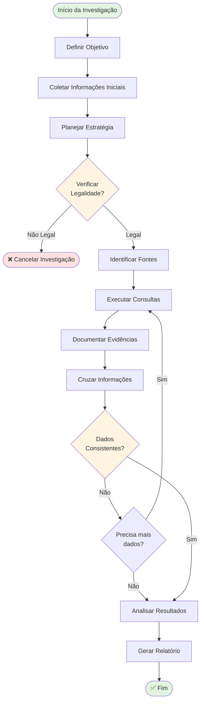
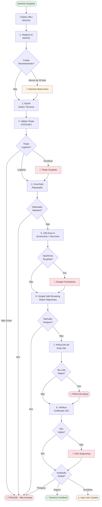
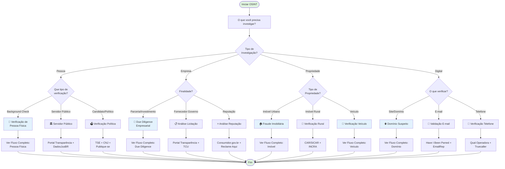

# 🔄 Fluxogramas de Investigação OSINT

  
  
  
  
  
  
  

## Índice
- [Metodologia OSINT Geral](#metodologia-geral)
- [Fluxo: Due Diligence Empresarial](#fluxo-empresa)
- [Fluxo: Verificação de Pessoa Física](#fluxo-pessoa)
- [Fluxo: Investigação de Fraude Imobiliária](#fluxo-imovel)
- [Fluxo: Verificação de Veículo](#fluxo-veiculo)
- [Fluxo: Análise de Domínio Suspeito](#fluxo-dominio)
- [Árvore de Decisão: Qual Investigação Fazer?](#arvore-decisao)

---

## 📊 Metodologia OSINT Geral {#metodologia-geral}

```mermaid
flowchart TD
    Start([Início da Investigação]) --> Define[Definir Objetivo]
    Define --> Collect[Coletar Informações Iniciais]
    Collect --> Plan[Planejar Estratégia]
    
    Plan --> Legal{Verificar<br/>Legalidade?}
    Legal -->|Não Legal| Stop1([❌ Cancelar Investigação])
    Legal -->|Legal| Sources[Identificar Fontes]
    
    Sources --> Execute[Executar Consultas]
    Execute --> Document[Documentar Evidências]
    Document --> CrossCheck[Cruzar Informações]
    
    CrossCheck --> Verify{Dados<br/>Consistentes?}
    Verify -->|Não| MoreData{Precisa mais<br/>dados?}
    MoreData -->|Sim| Execute
    MoreData -->|Não| Analyze
    
    Verify -->|Sim| Analyze[Analisar Resultados]
    Analyze --> Report[Gerar Relatório]
    Report --> End([✅ Fim])
    
    style Start fill:#e1f5e1
    style End fill:#e1f5e1
    style Stop1 fill:#ffe1e1
    style Legal fill:#fff4e1
    style Verify fill:#fff4e1
```

---

## 🏢 Fluxo: Due Diligence Empresarial {#fluxo-empresa}

```mermaid
flowchart TD
    Start([Iniciar Due Diligence]) --> Input[Coletar CNPJ/Razão Social]
    
    Input --> RF[1. Receita Federal<br/>Situação Cadastral]
    RF --> CheckRF{CNPJ<br/>Regular?}
    CheckRF -->|Não| Alert1[🚩 Red Flag:<br/>CNPJ Irregular]
    CheckRF -->|Sim| JUCESP
    
    Alert1 --> Decision1{Continuar<br/>Análise?}
    Decision1 -->|Não| Stop([❌ Reprovado])
    Decision1 -->|Sim| JUCESP
    
    JUCESP[2. JUCESP<br/>Contrato Social] --> Portal[3. Portal Transparência<br/>Contratos Públicos]
    Portal --> CheckContracts{Contratos<br/>Suspeitos?}
    CheckContracts -->|Sim| Alert2[🚩 Analisar Profundamente]
    CheckContracts -->|Não| Consumer
    
    Alert2 --> Consumer[4. Consumidor.gov.br<br/>Reclamações]
    Consumer --> CheckComplaints{Taxa de<br/>Reclamação OK?}
    CheckComplaints -->|Não| Alert3[🚩 Reputação Ruim]
    CheckComplaints -->|Sim| Judicial
    
    Alert3 --> Judicial[5. CNJ/JusBrasil<br/>Processos]
    Judicial --> CheckProcesses{Processos<br/>Graves?}
    CheckProcesses -->|Sim| Alert4[🚩 Histórico Judicial<br/>Problemático]
    CheckProcesses -->|Não| Partners
    
    Alert4 --> Partners[6. Verificar Sócios<br/>CPF + Processos]
    Partners --> CheckPartners{Sócios<br/>Limpos?}
    CheckPartners -->|Não| Alert5[🚩 Sócios com Pendências]
    CheckPartners -->|Sim| Domain
    
    Alert5 --> Domain[7. Registro.br<br/>Domínio]
    Domain --> Final{Aprovado na<br/>Análise?}
    
    Final -->|Sim| Approved([✅ Aprovado com Ressalvas])
    Final -->|Não| Stop
    
    style Start fill:#e1f5e1
    style Approved fill:#e1f5e1
    style Stop fill:#ffe1e1
    style Alert1 fill:#ffe1e1
    style Alert2 fill:#ffe1e1
    style Alert3 fill:#ffe1e1
    style Alert4 fill:#ffe1e1
    style Alert5 fill:#ffe1e1
```

---

## 👤 Fluxo: Verificação de Pessoa Física {#fluxo-pessoa}

```mermaid
flowchart TD
    Start([Iniciar Verificação]) --> Input[Coletar CPF/Nome Completo]
    
    Input --> GetName{Tem apenas<br/>CPF?}
    GetName -->|Sim| SitCad[0. situacao-cadastral.com<br/>Obter Nome Parcial]
    GetName -->|Não| CPF
    
    SitCad --> TRT[0b. TRT3 Certidão<br/>Nome Completo]
    TRT --> CPF[1. Receita Federal<br/>Situação CPF]
    
    CPF --> CheckCPF{CPF<br/>Regular?}
    CheckCPF -->|Não| Alert1[🚩 CPF Irregular/Suspenso]
    CheckCPF -->|Sim| CNJ
    
    Alert1 --> Decision{Critério<br/>Eliminatório?}
    Decision -->|Sim| Stop([❌ Reprovado])
    Decision -->|Não| CNJ
    
    CNJ[2. CNJ/Escavador<br/>Processos Judiciais] --> CheckCriminal{Processos<br/>Criminais?}
    CheckCriminal -->|Sim| Analyze1[Analisar Gravidade]
    CheckCriminal -->|Não| Transparency
    
    Analyze1 --> Serious{Processo<br/>Grave?}
    Serious -->|Sim| Stop
    Serious -->|Não| Transparency
    
    Transparency[3. Portal Transparência<br/>Vínculos Governo] --> TSE[4. TSE<br/>Doações/Candidaturas]
    TSE --> Social[5. Redes Sociais<br/>LinkedIn/Facebook]
    
    Social --> CheckSocial{Comportamento<br/>Adequado?}
    CheckSocial -->|Não| Alert2[🚩 Comportamento Inadequado]
    CheckSocial -->|Sim| Email
    
    Alert2 --> Email[6. Have I Been Pwned<br/>Vazamentos]
    Email --> CheckLeaks{Múltiplos<br/>Vazamentos?}
    CheckLeaks -->|Sim| Alert3[⚠️ Segurança Digital Fraca]
    CheckLeaks -->|Não| Academic
    
    Alert3 --> Academic[7. Lattes/E-MEC<br/>Formação]
    Academic --> CheckDegree{Diploma<br/>Válido?}
    CheckDegree -->|Não| Alert4[🚩 Formação Não Validada]
    CheckDegree -->|Sim| Final
    
    Alert4 --> Final{Resultado<br/>Final?}
    Final -->|Aprovado| Approved([✅ Aprovado])
    Final -->|Reprovado| Stop
    Final -->|Ressalvas| Conditional([⚠️ Aprovado com Ressalvas])
    
    style Start fill:#e1f5e1
    style Approved fill:#e1f5e1
    style Conditional fill:#fff4e1
    style Stop fill:#ffe1e1
    style Alert1 fill:#ffe1e1
    style Alert2 fill:#ffe1e1
    style Alert3 fill:#fff4e1
    style Alert4 fill:#ffe1e1
    style SitCad fill:#e3f2fd
    style TRT fill:#e3f2fd
```

---

## 🏠 Fluxo: Investigação de Fraude Imobiliária {#fluxo-imovel}

```mermaid
flowchart TD
    Start([Suspeita de Fraude]) --> Input[Coletar Endereço/<br/>Matrícula/Proprietário]
    
    Input --> Maps[1. Google Maps/Street View<br/>Verificar Existência Física]
    Maps --> Exists{Imóvel<br/>Existe?}
    Exists -->|Não| Fraud1([🚨 FRAUDE CONFIRMADA])
    Exists -->|Sim| CEP
    
    CEP[2. Correios<br/>Validar CEP] --> ValidCEP{CEP<br/>Válido?}
    ValidCEP -->|Não| Alert1[🚩 CEP Inválido]
    ValidCEP -->|Sim| Registry
    
    Alert1 --> Registry[3. Cartório de Imóveis<br/>Consultar Matrícula]
    Registry --> HasRegistry{Matrícula<br/>Válida?}
    HasRegistry -->|Não| Fraud1
    HasRegistry -->|Sim| Owner
    
    Owner[4. Verificar Proprietário<br/>na Matrícula] --> OwnerMatch{Proprietário<br/>Confere?}
    OwnerMatch -->|Não| Fraud1
    OwnerMatch -->|Sim| IPTU
    
    IPTU[5. Prefeitura<br/>Consultar IPTU] --> Debts{Débitos<br/>Ocultos?}
    Debts -->|Sim| Alert2[🚩 Débitos Não Declarados]
    Debts -->|Não| Liens
    
    Alert2 --> Liens[6. Verificar<br/>Ônus/Gravames] --> HasLiens{Hipotecas/<br/>Restrições?}
    HasLiens -->|Sim Não Declaradas| Fraud2[🚨 Informações Ocultas]
    HasLiens -->|Não ou Declaradas| ValidateSeller
    
    Fraud2 --> ValidateSeller[7. Validar Vendedor<br/>CPF + CNJ]
    ValidateSeller --> SellerOK{Vendedor<br/>Idôneo?}
    SellerOK -->|Não| Alert3[🚩 Vendedor com Processos]
    SellerOK -->|Sim| Broker
    
    Alert3 --> Broker[8. Verificar Corretor<br/>CRECI]
    Broker --> BrokerValid{CRECI<br/>Ativo?}
    BrokerValid -->|Não| Fraud3[🚨 Corretor Irregular]
    BrokerValid -->|Sim| Price
    
    Fraud3 --> Price[9. Comparar Preço<br/>com Mercado]
    Price --> PriceOK{Preço<br/>Razoável?}
    PriceOK -->|Muito Baixo| Alert4[🚩 Preço Suspeito]
    PriceOK -->|OK| Final
    
    Alert4 --> Final{Avaliação<br/>Final?}
    Final -->|Seguro| Safe([✅ Transação Segura])
    Final -->|Risco Alto| Fraud1
    Final -->|Risco Médio| Caution([⚠️ Prosseguir com Cautela])
    
    style Start fill:#e1f5e1
    style Safe fill:#e1f5e1
    style Caution fill:#fff4e1
    style Fraud1 fill:#ffe1e1
    style Fraud2 fill:#ffe1e1
    style Fraud3 fill:#ffe1e1
    style Alert1 fill:#ffe1e1
    style Alert2 fill:#ffe1e1
    style Alert3 fill:#ffe1e1
    style Alert4 fill:#ffe1e1
```

---

## 🚗 Fluxo: Verificação de Veículo {#fluxo-veiculo}

```mermaid
flowchart TD
    Start([Verificar Veículo]) --> Input[Coletar Placa/<br/>Chassi/RENAVAM]
    
    Input --> DETRAN[1. DETRAN<br/>Dados Básicos]
    DETRAN --> CheckStatus{Status<br/>OK?}
    CheckStatus -->|Restrição Judicial| Fraud1([🚨 NÃO COMPRAR])
    CheckStatus -->|OK| Theft
    
    Theft[2. SINESP/Consulta<br/>Roubo/Furto] --> Stolen{Registro de<br/>Roubo?}
    Stolen -->|Sim| Fraud1
    Stolen -->|Não| Auction
    
    Auction[3. Portal Leilões<br/>Histórico] --> WasAuction{Foi<br/>Leiloado?}
    WasAuction -->|Sim| Alert1[⚠️ Verificar Motivo<br/>Pode ser sinistro]
    WasAuction -->|Não| Debts
    
    Alert1 --> Debts[4. Consultar<br/>IPVA + Multas]
    Debts --> HasDebts{Débitos<br/>Altos?}
    HasDebts -->|Sim| Alert2[🚩 Negociar Abatimento]
    HasDebts -->|Não| Seller
    
    Alert2 --> Seller[5. Validar Vendedor<br/>CPF + Processos]
    Seller --> SellerOK{Vendedor<br/>Confiável?}
    SellerOK -->|Não| Alert3[🚩 Vendedor Suspeito]
    SellerOK -->|Sim| Recall
    
    Alert3 --> Recall[6. PROCON<br/>Consultar Recall]
    Recall --> HasRecall{Recall<br/>Pendente?}
    HasRecall -->|Sim| Alert4[⚠️ Exigir Regularização]
    HasRecall -->|Não| Price
    
    Alert4 --> Price[7. Tabela FIPE<br/>Valor de Mercado]
    Price --> PriceOK{Preço<br/>Compatível?}
    PriceOK -->|Muito Abaixo| Alert5[🚩 Preço Suspeito<br/>Investigar Mais]
    PriceOK -->|OK| Doc
    
    Alert5 --> Doc[8. Verificar<br/>Documentação]
    Doc --> DocOK{Documentos<br/>Legítimos?}
    DocOK -->|Não| Fraud2([🚨 Documentação Falsa])
    DocOK -->|Sim| Final
    
    Fraud2 --> Final{Decisão<br/>Final?}
    Final -->|Aprovado| Buy([✅ Pode Comprar])
    Final -->|Ressalvas| Negotiate([⚠️ Negociar Melhor])
    Final -->|Reprovado| Fraud1
    
    style Start fill:#e1f5e1
    style Buy fill:#e1f5e1
    style Negotiate fill:#fff4e1
    style Fraud1 fill:#ffe1e1
    style Fraud2 fill:#ffe1e1
    style Alert1 fill:#fff4e1
    style Alert2 fill:#ffe1e1
    style Alert3 fill:#ffe1e1
    style Alert4 fill:#fff4e1
    style Alert5 fill:#ffe1e1
```

---

## 🌐 Fluxo: Análise de Domínio Suspeito {#fluxo-dominio}

```mermaid
flowchart TD
    Start([Domínio Suspeito]) --> Input[Coletar URL/<br/>Domínio]
    
    Input --> Whois[1. Registro.br<br/>WHOIS]
    Whois --> Recent{Criado<br/>Recentemente?}
    Recent -->|Menos de 30 dias| Alert1[🚩 Domínio Muito Novo]
    Recent -->|Não| RDAP
    
    Alert1 --> RDAP[2. RDAP<br/>Dados Técnicos]
    RDAP --> Owner[3. Validar Titular<br/>CPF/CNPJ]
    
    Owner --> ValidOwner{Titular<br/>Legítimo?}
    ValidOwner -->|Não Existe| Fraud1([🚨 FRAUDE - Não Acessar])
    ValidOwner -->|Duvidoso| Alert2[🚩 Titular Suspeito]
    ValidOwner -->|Legítimo| VT
    
    Alert2 --> VT[4. VirusTotal<br/>Reputação]
    VT --> HasMalware{Detectado<br/>Malware?}
    HasMalware -->|Sim| Fraud1
    HasMalware -->|Não| URLScan
    
    URLScan[5. URLScan.io<br/>Screenshot + Recursos]
    URLScan --> Suspicious{Aparência<br/>Suspeita?}
    Suspicious -->|Sim| Alert3[🚩 Design Fraudulento]
    Suspicious -->|Não| SafeBrowsing
    
    Alert3 --> SafeBrowsing[6. Google Safe Browsing<br/>Status Segurança]
    SafeBrowsing --> Unsafe{Marcado<br/>Inseguro?}
    Unsafe -->|Sim| Fraud1
    Unsafe -->|Não| Procon
    
    Procon[7. PROCON-SP<br/>Evite Site]
    Procon --> Reported{Na Lista<br/>Negra?}
    Reported -->|Sim| Fraud2([🚨 PROCON Alerta])
    Reported -->|Não| SSL
    
    Fraud2 --> SSL[8. Verificar<br/>Certificado SSL]
    SSL --> ValidSSL{SSL<br/>Válido?}
    ValidSSL -->|Não| Alert4[🚩 Sem Segurança]
    ValidSSL -->|Sim| Final
    
    Alert4 --> Final{Avaliação<br/>Global?}
    Final -->|Seguro| Safe([✅ Domínio Confiável])
    Final -->|Duvidoso| Caution([⚠️ Usar com Cautela])
    Final -->|Perigoso| Fraud1
    
    style Start fill:#e1f5e1
    style Safe fill:#e1f5e1
    style Caution fill:#fff4e1
    style Fraud1 fill:#ffe1e1
    style Fraud2 fill:#ffe1e1
    style Alert1 fill:#fff4e1
    style Alert2 fill:#ffe1e1
    style Alert3 fill:#ffe1e1
    style Alert4 fill:#ffe1e1
```

---

## 🌳 Árvore de Decisão: Qual Investigação Fazer? {#arvore-decisao}

```mermaid
flowchart TD
    Start([Iniciar OSINT]) --> Question[O que você precisa investigar?]
    
    Question --> Type{Tipo de<br/>Investigação?}
    
    Type -->|Pessoa| PersonType{Que tipo de<br/>verificação?}
    PersonType -->|Background Check| Person[👤 Verificação de<br/>Pessoa Física]
    PersonType -->|Servidor Público| Public[🏛️ Servidor Público]
    PersonType -->|Candidato/Político| Political[🗳️ Verificação Política]
    
    Type -->|Empresa| CompanyType{Finalidade?}
    CompanyType -->|Parceria/Investimento| Company[🏢 Due Diligence<br/>Empresarial]
    CompanyType -->|Fornecedor Governo| Gov[📋 Análise Licitação]
    CompanyType -->|Reputação| Reputation[⭐ Análise Reputação]
    
    Type -->|Propriedade| PropertyType{Tipo de<br/>Propriedade?}
    PropertyType -->|Imóvel Urbano| Property[🏠 Fraude Imobiliária]
    PropertyType -->|Imóvel Rural| Rural[🌾 Verificação Rural]
    PropertyType -->|Veículo| Vehicle[🚗 Verificação Veículo]
    
    Type -->|Digital| DigitalType{O que verificar?}
    DigitalType -->|Site/Domínio| Domain[🌐 Domínio Suspeito]
    DigitalType -->|E-mail| Email[📧 Validação E-mail]
    DigitalType -->|Telefone| Phone[📱 Verificação Telefone]
    
    Person --> Execute1[Ver Fluxo Completo:<br/>Pessoa Física]
    Public --> Execute2[Portal Transparência +<br/>DadosJusBR]
    Political --> Execute3[TSE + CNJ +<br/>Publique-se]
    
    Company --> Execute4[Ver Fluxo Completo:<br/>Due Diligence]
    Gov --> Execute5[Portal Transparência +<br/>TCU]
    Reputation --> Execute6[Consumidor.gov.br +<br/>Reclame Aqui]
    
    Property --> Execute7[Ver Fluxo Completo:<br/>Imóvel]
    Rural --> Execute8[CAR/SICAR +<br/>INCRA]
    Vehicle --> Execute9[Ver Fluxo Completo:<br/>Veículo]
    
    Domain --> Execute10[Ver Fluxo Completo:<br/>Domínio]
    Email --> Execute11[Have I Been Pwned +<br/>EmailRep]
    Phone --> Execute12[Qual Operadora +<br/>Truecaller]
    
    Execute1 --> End([Fim])
    Execute2 --> End
    Execute3 --> End
    Execute4 --> End
    Execute5 --> End
    Execute6 --> End
    Execute7 --> End
    Execute8 --> End
    Execute9 --> End
    Execute10 --> End
    Execute11 --> End
    Execute12 --> End
    
    style Start fill:#e1f5e1
    style End fill:#e1f5e1
    style Person fill:#e3f2fd
    style Company fill:#e3f2fd
    style Property fill:#e3f2fd
    style Vehicle fill:#e3f2fd
    style Domain fill:#e3f2fd
```

---

## 📝 Como Usar os Fluxogramas

### 1. **Identificar o Tipo de Investigação**
Use a [Árvore de Decisão](#arvore-decisao) para determinar qual fluxo seguir.

### 2. **Seguir o Fluxo Passo a Passo**
Cada caixa representa uma ação ou consulta específica. Execute na ordem apresentada.

### 3. **Observar os Alertas**
- 🚩 **Red Flag** (vermelho): Problema grave, avaliar se continua
- ⚠️ **Alerta** (amarelo): Atenção necessária, mas não eliminatório
- ✅ **Aprovado** (verde): Tudo certo
- ❌ **Reprovado** (vermelho): Critério eliminatório

### 4. **Documentar Cada Etapa**
- Salve screenshots das consultas
- Anote data e hora
- Registre fontes utilizadas
- Mantenha cadeia de custódia

### 5. **Cruzar Informações**

> [!IMPORTANT]
> Não confie em uma única fonte. Valide com múltiplas consultas.

---

## 🔗 Links Relacionados

- [README Principal](README.md) - Lista completa de fontes
- [Exemplos Práticos](EXEMPLOS_PRATICOS.md) - Casos detalhados passo a passo
- [Guia Rápido](GUIA_RAPIDO.md) - Tabelas e consultas rápidas

---

## 📊 Visualizando os Fluxogramas

> [!NOTE]
> Os fluxogramas acima usam sintaxe **Mermaid** e são renderizados automaticamente no GitHub.

Para visualizar localmente:
1. Use extensões de Markdown com suporte a Mermaid
2. VSCode: instale "Markdown Preview Mermaid Support"
3. Ou copie o código para: https://mermaid.live/

---

  Última atualização: Dezembro 2025 
  Projeto OSINT Brazuca - Fluxogramas de Investigação 
  📊 Visualize, Planeje, Execute

