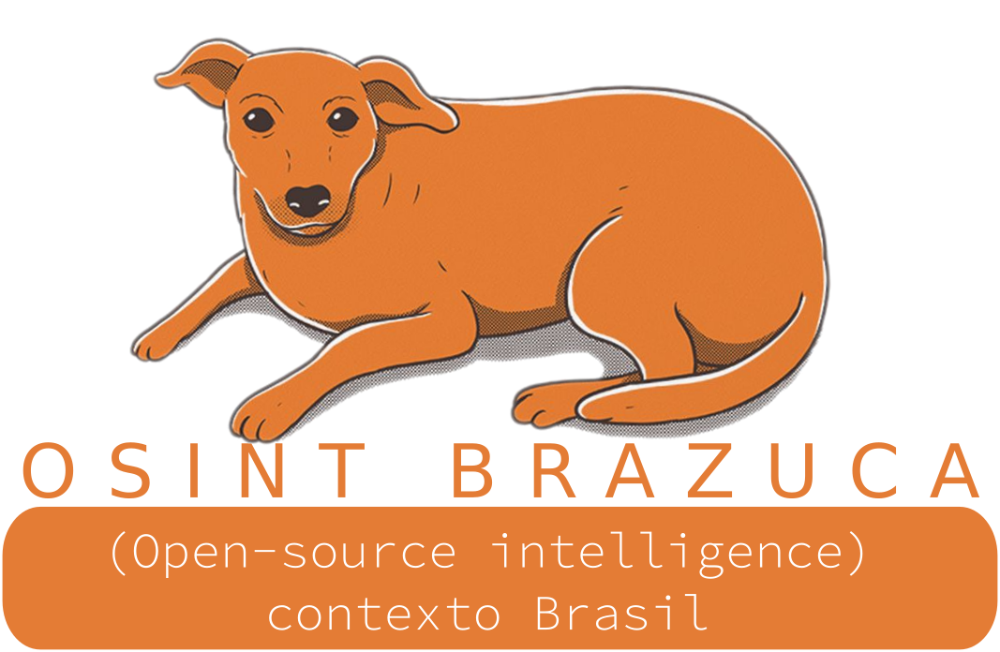

<p style="text-align:center" align="center">
<br>
Repositório criado com intuito de reunir informações, fontes(websites/portais) e tricks de OSINT dentro do contexto Brasil 🇧🇷
</p>
<p align="center">[EM CONSTRUÇÃO]</center></p>

<p align="center">
 
 

</center>
<p>

# Sumário
- [Benefícios Sociais](#beneficios-sociais)
- [Consulta de Processos](#consulta-processos)
- [Busca de Informações via CPF/CNPJ](#busca-cpf-cnpj)
- [Telecom](#telecom)
- [Estação Rádio Base - ERBs](#estacoes-radio-erbs)
- [Informações Acadêmicas](#informacoes-academicas)
- [Mapas e Georreferenciamento](#mapas-geo)
- [Saúde](#saude)
- [Motores de Busca Contexto Brasil](#dorks)
- [Rede Social](#redes-sociais)
- [Indexadores de Serviço de Mensagens Instantâneas](#indexador-mensagens)
- [Consulta de Transporte Terrestre](#consulta-transporte-terrestre)
- [Consulta de Transporte Aéreo](#consulta-transporte-aereo)
- [Câmeras Online](#cameras-online)
- [Outras Buscas](#outras-buscas)
- [Categorias de Domínios .br](#dominios-br)
- [Categorias por Estados Brasileiros](#estados-br)
    - [Acre](#acre)
    - [Alagoas](#alagoas)
    - [Amapá](#amapa)
    - [Amazonas](#amazonas)
    - [Bahia](#bahia)
    - [Ceará](#ceara)
    - [Distrito Federal](#distrito-federal)
    - [Espírito Santo](#espirito-santo)
    - [Goiás](#goias)
    - [Maranhão](#maranhao)
    - [Mato Grosso](#mato-grosso)
    - [Mato Grosso do Sul](#mato-grosso-sul)
    - [Minas Gerais](#minas-gerais)
    - [Pará](#para)
    - [Paraíba](#paraiba)
    - [Paraná](#parana)
    - [Pernambuco](#pernambuco)
    - [Piauí](#piaui)
    - [Rio de Janeiro](#rio-janeiro)
    - [Rio Grande do Norte](#rio-grande-norte)
    - [Rio Grande do Sul](#rio-grande-sul)
    - [Rondônia](#rondonia)
    - [Roraima](#roraima)
    - [Santa Catarina](#santa-catarina)
    - [São Paulo](#sao-paulo)
    - [Sergipe](#sergipe)
    - [Tocantins](#tocantins)
 - [Autores](#autores)
 - [Contribuições](#contribuicoes)
 - [Créditos](#creditos)

---

## Benefícios sociais (Políticas Públicas) 📑 <a name="beneficios-sociais"></a>
### Consulta Benefícios Sociais
As famílias atendidas pelo Programa Bolsa Família devem entregar o extrato bancário de pagamento do benefício, juntamente com a consulta pública do programa “bolsa família” 
- https://www.beneficiossociais.caixa.gov.br/consulta/beneficio/04.01.00-00_00.asp

### Consulta ao Auxílio Emergencial
canal para consulta ao resultado da análise do Auxílio Emergencial.
Por aqui você terá condições de saber se atende aos critérios de elegibilidade para recebimento do Auxílio Emergencial.
- https://consultaauxilio.cidadania.gov.br/consulta/#/

### Comprovante Situação Cadastral de Pessoa Jurídica
Comprovante de Inscrição e de Situação Cadastral de Pessoa Jurídica, obtido por meio de consulta no endereço eletrônico:
- http://www.receita.fazenda.gov.br/PessoaJuridica/CNPJ/cnpjreva/Cnpjreva_Solicitacao.asp

### Extrato do Benefício de Prestação Continuada (INSS)
- em processo...

---

## Consulta de Processos 🧑‍⚖️ <a name="consulta-processos"></a>
### Portal e-S**
O portal e-S** é uma solução que visa facilitar a troca de informações e agilizar o trâmite processual por meio de diversos serviços WEB voltados para os advogados, cidadãos e serventuários da justiça.
- https://esaj.tjac.jus.br/esaj/portal.do?servico=190090#
- https://esaj.tjba.jus.br/esaj/portal.do?servico=190090#
- https://esaj.tjce.jus.br/esaj/portal.do?servico=190090#
- https://esaj.tjsc.jus.br/esaj/portal.do?servico=190090#
- https://esaj.tjsp.jus.br/esaj/portal.do?servico=190090#
- http://esaj.tjac.jus.br/esaj/portal.do?servico=190090#
- http://esaj.tjam.jus.br/esaj/portal.do?servico=190090#
- http://esaj.tjce.jus.br/esaj/portal.do?servico=190090#

### Portais de Tribunais Regionais Federal (TRF)
__TRF1__: O Tribunal Regional Federal da 1ª Região, com sede em Brasília, tem sob sua jurisdição o Distrito Federal e os estados do Acre, Amapá, Amazonas, Bahia, Goiás, Maranhão, Mato Grosso, Minas Gerais, Pará, Piauí, Rondônia, Roraima e Tocantins.
<br>
__TRF2__: 2a instância da Justiça Federal da 2a Região, com jurisdição no Rio de Janeiro e no Espírito Santo.
<br>
__TRF5__: Portal com informações e serviços providos pelo TRF5, tem sob sua jurisdição   jfal ,jfce ,jfpb ,jfpe ,jfrn ,jfse.
- httpS://portal.trf1.jus.br
- https://portal.trf2.jus.br
- https://portal.trf5.jus.br

### JusBrasil
Startup que une Direito e Tecnologia para fazer com que a justiça ultrapasse as fronteiras dos tribunais e chegue às casas de qualquer cidadão ou cidadã, empoderando suas decisões por meio da informação. 
- https://www.jusbrasil.com.br/

### Escavador
Encontre e acompanhe informações relevantes para você sua empresa seu cliente. Pesquise por pessoas, instituições, processos judiciais ou qualquer termo do seu interesse.
- https://www.escavador.com/
---

## Busca de Informações via CPF/CNPJ 🔭 <a name="busca-cpf-cnpj"></a>
### Busca Dados Usando CNPJ
- http://servicos.receita.fazenda.gov.br/Servicos/cnpjreva/Cnpjreva_Solicitacao.asp
- https://brasilcnpj.net/
- https://cnpj.biz/
- https://cadastroempresa.com.br/
- https://casadosdados.com.br/
- https://cnpjs.rocks/
- https://www.informecadastral.com.br/
- https://www.situacaocadastral.info/
- http://www8.receita.fazenda.gov.br/simplesnacional/aplicacoes.aspx?id=21

### Busca Nome Usando CPF/CNPJ
A intenção deste serviço é ajudar você descobrir e confirmar qual a situação cadastral do documento de CPF (Cadastro de Pessoa Física) e/ou CNPJ (Cadastro Nacional da Pessoa Jurídica).
- https://www.situacao-cadastral.com/ 

---
## Telecom 📡 <a name="telecom"></a>

### Busca Através do IMEI/Legalidade do Aparelho
- https://www.consultaserialaparelho.com.br/public-web/homeSiga 

### Busca Através da Operadora
- https://consultanumero.abrtelecom.com.br/consultanumero/consulta/consultaSituacaoAtualCtg

### Busca Operadora por Número Celular
- https://consultanumero.info/
- https://www.qualoperadora.net/
- http://consultaoperadora.com.br/site2015/

### Busca Operadora / Linha Pré ativa por CPF 
Consultar se possui linha pré-paga ativa nas Prestadoras participantes (Algar, Claro, Oi, Sercomtel, TIM e Vivo).
- https://cadastropre.com.br/#/consulta

### Base De Orelhão X Mapa
Por meio da busca é possível encontrar orelhões pelo número, localizar ruas, municípios, estados ou cidades
- http://sistemas.anatel.gov.br/sgmu/fiqueligado/tups.asp

### Números Discagem direta a distância ( DDD )
- https://pt.wikipedia.org/wiki/Discagem_direta_a_dist%C3%A2ncia
- https://www.mbi.com.br/mbi/biblioteca/utilidades/estado-onde-fica-ddd/
---

## Estação Rádio Base / ERBs 📻 <a name="estacoes-radio-erbs"></a>
Estações Radio Base ou ERBs são equipamentos que fazem a conexão entre os telefones celulares e a companhia telefônica, ou mais precisamente a Central de Comutação e Controle (CCC).
- https://www.teleco.com.br/erb.asp
- https://sistemas.anatel.gov.br/stel/consultas/ListaEstacoesLocalidade/tela.asp?pNumServico=010
- http://www.telecocare.com.br/telebrasil/mapa_erb.php
- http://sistemas.anatel.gov.br/se/public/view/b/licenciamento.php
- http://sistemas.anatel.gov.br/siec-servico-movel-web/
- https://dados.gov.br/dataset?tags=ERB
- https://www.google.com/maps/d/u/0/viewer?msa=0&mid=1Xh8EWBDY97vtLnEYuAVLvRGvu2o&ll=-16.816639560865948%2C-51.73607799999998&z=5
- http://www.coberturacelular.com.br/

## Informações Acadêmicas  📄 <a name="informacoes-academicas"></a>
### Buscar Currículo Lattes
Conselho Nacional de Desenvolvimento Científico e Tecnológico (CNPq) é uma entidade ligada ao Ministério da Ciência, Tecnologia, Inovações e Comunicações para incentivo à pesquisa no Brasil.
- https://buscatextual.cnpq.br/buscatextual/busca.do?metodo=apresentar

---

## Mapas e Georreferenciamento 🗺️ <a name="mapas-geo"></a>
### Imagens de Satélite via inpe.br
Instituto Nacional de Pesquisas Espaciais é um instituto federal brasileiro dedicado à pesquisa e exploração espacial, criado em 1961.
- http://www.dgi.inpe.br/catalogo/
- http://sigma.cptec.inpe.br/
- http://sigma2.cptec.inpe.br/
- http://sigma.cptec.inpe.br/radar/
- http://sigma.cptec.inpe.br/prec_sat/
- http://sigma.cptec.inpe.br/fortracc/
- http://satelite.cptec.inpe.br/vento/
- http://satelite.cptec.inpe.br/radiacao/
- http://terrabrasilis.dpi.inpe.br/app/map/alerts?hl=pt-br
- http://terrabrasilis.dpi.inpe.br/app/map/deforestation?hl=pt-br
- http://www2.dgi.inpe.br/catalogo/explore
- http://satelite.cptec.inpe.br/mapsat/
- http://sigma-soschuva.cptec.inpe.br/#
- https://queimadas.dgi.inpe.br/queimadas/bdqueimadas
- https://queimadas.dgi.inpe.br/queimadas/portal-static/situacao-atual/
- https://queimadas.dgi.inpe.br/queimadas/portal/videoaulas
- https://queimadas.dgi.inpe.br/queimadas/mapas-mensais/
- http://www.dgi.inpe.br/CDSR/
- https://www.arcgis.com/home/webmap/viewer.html?url=https%3A%2F%2Farcgis.sema.df.gov.br%2Fserver%2Frest%2Fservices%2FAreas_Queimadas%2FMapServer&source=sd
- https://arcgis.sema.df.gov.br/server/rest/services/Areas_Queimadas/MapServer
- https://www.cptec.inpe.br/dsat/
- http://mapas.sosma.org.br/
- http://www.inpe.br/webelat/homepage/
    
### Instituto do Patrimônio Histórico e Artístico Nacional (IPHAN) 🗿
O SICG (Sistema Integrado de Conhecimento e Gestão) é o desenvolvimento de Inventários de Conhecimento, para formar uma base de informações sobre os patrimônio cultural de todo o Brasil.
- https://sicg.iphan.gov.br/sicg/pesquisarBem
    
---
   
## Saúde 🏥 <a name="saude"></a>
### Fundo Nacional de Saúde (FNS)
- https://consultafns.saude.gov.br/#/consolidada

---

## Motores de Busca Contexto Brasil 🤖 <a name="dorks"></a>
### Google Hacking: DataLeak/SQL
- ```site:com.br ext:sql "CREATE TABLE"```
    - https://www.google.com/search?q=site%3Acom.br+ext%3Asql+%22CREATE+TABLE%22### 
    
- ```site:com.br intext:"phpMyAdmin" ext:txt```
    - https://www.google.com/search?q=site%3Acom.br+intext%3A%22phpMyAdmin%22+ext%3Atxt

### Google Hacking: Documento em Arquivos
- ```cpf "SEU_ALVO" ext:txt```
    - https://www.google.com/search?q=cpf+%22SE_ALVO%22+%22123456789%22+ext
- ```"cpf|cnpj|email|rg|contato" ext:xls "SEU_ALVO"```
    - https://www.google.com/search?q=%22cpf%7Ccnpj%7Cemail%7Crg%7Ccontato%22+ext%3Axls+%22SE_ALVO%22

### Google Hacking: Sites do Governo
Adicione sua string alvo para direcionar a busca
- ```site:mil.br```
    - https://www.google.com/search?q=site%3Amil.br
- ```site:gov.br```
    - https://www.google.com/search?q=site%3Agov.br

### Google Hacking:  Documentos em Sites do Governo
Adicione sua string alvo para direcionar a busca
- ```site:mil.br ext:pdf```
    - https://www.google.com/search?q=site%3Amil.br
- ```site:gov.br  ext:xls```
    - https://www.google.com/search?q=site%3Agov.br
- ```inurl:"mil.br" ext:php```
    - https://www.google.com/search?q=inurl:%22mil.br%22+ext:php

### Google Hacking: Informações Expostas
Adicione sua string alvo para direcionar a busca
- ```site:anonfiles.com "SE_ALVO"```
    - https://www.google.com/search?q=site%3Aanonfiles.com+%22SE_ALVO%22
- ```site:docs.google.com "SEU_ALVO"```
    - https://www.google.com/search?q=site%3Adocs.google.com+%22SEU_ALVO%E2%80%9D
- ```site:facebook.com "SEU_ALVO"```
    - https://www.google.com/search?q=site%3Afacebook.com+%22SEU_ALVO%22
- ```site:pastebin.com "SEU_ALVO" ```
    - https://www.google.com/search?q=site%3Apastebin.com+%22nubank%22

### Google Hacking: Filtrar Empresa via Linkedin
Adicione sua string alvo para direcionar a busca
- ```site:linkedin.com "at EMPRESA_ALVO"```
    - https://www.google.com/search?q=site%3Alinkedin.com+%22at+EMPRESA_ALVO%22

### Google Hacking: Filtrar Grupos WhatsApp em Sites .br
- ```"https://chat.whatsapp.com/" & site:br"```
    - https://www.google.com/search?q=%22https%3A%2F%2Fchat.whatsapp.com%2F%22+%26+site%3Abr

### Google Hacking: Filtrar Grupos Telegram + Contexto da String
- ```inurl:"https://t.me" site:me "SEU_ALVO"```
    - https://www.google.com/search?q=inurl%3A%22https%3A%2F%2Ft.me%22+site%3Ame+%22SEU_ALVO%22
- ```site:me "joinchat" "SEU_ALVO"```
    - https://www.google.com/search?q=site%3Ame+%22joinchat%22+%22Bolsonaro%22


### Shodan: Busca de Servidores Brasileiro
Shodan é um mecanismo de pesquisa que permite ao usuário encontrar tipos específicos de computadores conectados à Internet usando uma variedade de filtros.
- ```country:"BR"```
    - https://www.shodan.io/search?query=country%3A%22BR%22
---

## Rede Social 👥 <a name="redes-sociais"></a>
### LinkedIn
É uma rede social de negócios fundada com mais de 750 milhões de usuários.
- https://www.linkedin.com/jobs/search/?keywords=SEU_ALVO&location=Brasil

### Twitter
É uma rede social e um servidor para microblogging.
- ```seu_alvo lang:pt```
    - https://twitter.com/search?q=seu_alvo+lang%3Apt&src=typed_query
    - https://twitter.com/search-advanced

### Snap Map
- https://map.snapchat.com/@-15.127315,-51.412151,4.51z


### Facebook Biblioteca de Anúncios
A Biblioteca de Anúncios garante a transparência publicitária oferecendo uma coleção abrangente e pesquisável de todos os anúncios em veiculação nos aplicativos e serviços do Facebook, incluindo o Instagram
- https://www.facebook.com/ads/library/?active_status=all&ad_type=all&country=BR&media_type=all

---

## Indexadores de Serviço de Mensagens Instantâneas 💬 <a name="indexador-mensagens"></a>
### Grupos de WhatsApp
WhatsApp é um aplicativo multiplataforma de mensagens instantâneas e chamadas de voz para smartphones.
- https://gruposwhats.app/
- https://whatsapp.statusestories.com/
- https://grupos-online.com/
- https://grupowhats.online/
- https://buscagrupos.com.br/
- https://www.gruposwats.com/
- https://gruposputaria.com/
- https://www.gruposexozap.com.br/
- https://www.grupopaquera.com.br/
- https://gruposdezap.com/

### Grupos de Telegram
O Telegram é um serviço de mensagens instantâneas baseado na nuvem.
- ```"SEU_ALVO"```
- ```("password"|"senha")```
    - https://tgstat.com/search
- ```"SEU_ALVO"```
- ```("password"|"senha")```    
    - https://cse.google.com/cse?cx=008239573640124656331:o29gdxc2osj
- https://www.telegram-group.com/en/#
- https://tgstat.com/
- https://xtea.io/ts_en.html#gsc.tab=0&gsc.q=SEU_ALVO
- https://telemetr.io/en/channels?language=pt&channel=SEU_ALVO&period=30
- https://combot.org/telegram/top/groups?lng=pt&page=1&q=SEU_ALVO

---
## Consulta de Transporte Terrestre 🚗 <a name="consulta-transporte-terrestre"></a>
### Consulta de Licenciamento Veicular 
- http://licenciamento.detran.ma.gov.br/Licenciamento/consulta/Home.xhtml *Estado do Maranhão*

### Consulta de Dados via Placa
- https://carfacts.com.br/ConsultaGratis
- https://www.qualveiculo.net/
- https://www.olhonocarro.com.br/
- https://www.consultarplaca.com.br/
- http://infocarrosp.com.br/
- https://www.iq.com.br/veiculos/consulta-placa/
- https://www.carcheck.com.br/
- https://www.consultapelaplaca.com.br/
- https://site.bibipecas.com.br/home
- https://www.historicar.com.br/

### Consulta Históricos de Ônibus
As buscas do Ônibus Brasil são um serviço de utilidade pública que permite rastrear registros históricos de ônibus que circulam ou circularam pelas ruas do Brasil e diversos outros países.
- https://onibusbrasil.com/placas

### Consulta Veículos Habilitados pela ANTT
Permite visualizar os veículos, nacionais e estrangeiros, habilitados pela ANTT ao transporte rodoviário internacional de cargas.
- https://appweb1.antt.gov.br/scff/conPlaca.asp

### Consulta Linhas de Ônibus
Consulta Linhas que Fazem Ligação entre Duas Localidades
- https://portal.antt.gov.br/linhas-de-onibus

### Consulta Horários e Passagens Ônibus
Somos o portal de pesquisa de horários e passagens de ônibus mais completo e mais acessado do Brasil, chegando a 4,1 milhões de visitas mensais.
- https://www.buscaonibus.com.br/

### Empresas Habilitadas
Empresas habilitadas para a prestação do serviço de transporte rodoviário coletivo interestadual e internacional de passageiros, sob regime de autorização e fretamento.
- https://dados.antt.gov.br/dataset/empresas-habilitadas

### Consulta Pública de Transportadores
RNTRC - Registro Nacional de Transportadores Rodoviários de Cargas
- https://consultapublica.antt.gov.br/Site/ConsultaRNTRC.aspx/consultapublica

### Pesquisar no Portal de Dados Abertos da ANTT
A Política de Dados Abertos do Poder Executivo Federal, instituída pelo Decreto n° 8.777, de 11 de maio de 2016, tem o objetivo de aprimorar a cultura de transparência pública ao estabelecer regras para publicação, em formato aberto.
- https://dados.antt.gov.br/

---

## Consulta de Transporte Aéreo 🛫 <a name="consulta-transporte-aereo"></a>

### Consulta de Vôos via Infraero
As informações aqui fornecidas são obtidas diretamente das companhias aéreas. Não nos responsabilizamos por consequências resultantes de possíveis erros ou omissões.
- http://voos.infraero.gov.br/voos/index.aspx

### Consulta de Vôos de autoridades Brasileiras
Os dados incluem a autoridade solicitante, trajeto, data, horário de decolagem e de pouso, o motivo da solicitação, além da previsão do número de passageiros;
- https://www.fab.mil.br/voos

### Consulta de Empresas e de Aeronaves de Táxi-Aéreo
A ANAC disponibiliza uma consulta de empresas ou aeronaves de táxi-aéreo a todos os cidadãos interessados.
- https://sistemas.anac.gov.br/voeseguro/

### Consulta de Nada Consta de Multas do CBAER
- https://sistemas.anac.gov.br/nadaconsta/

### Consultas ao Registro Aeronáutico Brasileiro (RAB)
Todas as aeronaves civis brasileiras devem ser registradas na ANAC. O Registro Aeronáutico Brasileiro (RAB) – regulamentado por meio da Resolução ANAC nº 293/2013
- https://sistemas.anac.gov.br/aeronaves/cons_rab.asp

---

## Câmeras Online 🎥 <a name="cameras-online"></a>
### Projeto City Câmeras
O Projeto City Câmeras é um programa público, de iniciativa exclusiva da Prefeitura Municipal de São Paulo, que visa constituir uma ampla rede de videomonitoramento por meio de câmeras públicas e privadas instaladas pela cidade.
- https://www.citycameras.prefeitura.sp.gov.br/home

### Câmeras Cia. de Engenharia de Tráfego (CET)
- http://cameras.cetsp.com.br/

### Câmeras DER - Departamento de Estradas de Rodagem (DER)
- http://www.der.sp.gov.br/WebSite/Servicos/ServicosOnline/CamerasOnlineMapa.aspx

### Câmeras Rodovias Online
O site Rodovias Online é um serviço de Utilidade Pública, onde procuramos reunir de forma fácil e eficaz visualizações de câmeras on-line.
- http://www.rodoviasonline.com.br/rodovias-der-sp/
    - http://www.rodoviasonline.com.br/cameras-ao-vivo-das-rodovias-do-estado-do-parana/
    - https://www.rodoviasonline.com.br/cameras-ao-vivo-nas-rodovias-do-rio-grande-de-sul-daer-rs/
    - https://www.rodoviasonline.com.br/rodovia-governador-ney-braga-br-277/
    - https://www.rodoviasonline.com.br/cameras-ao-vivo-viapar-parana/

### Câmeras Concessionária Tamoios
- https://concessionariatamoios.com.br/cameras/ver/12
- https://concessionariatamoios.com.br/cameras/ver/14
- https://concessionariatamoios.com.br/cameras/ver/10
- https://concessionariatamoios.com.br/cameras/ver/9
- https://concessionariatamoios.com.br/cameras/ver/8
- https://concessionariatamoios.com.br/cameras/ver/13


### Câmeras Concessionária EcoRodovias
- https://www.ecovias.com.br/condicoes-da-via#condition-camera

    - BALANCA IMIGRANTES PLANALTO
        - https://www.ecovias.com.br/boletim/camera/2
    - ENTRADA IMIGRANTES PLANALTO
        - http://site.ecovias.com.br/cameras/vpon/0kamera1.jpg
    - PEDAGIO IMIGRANTES
        - https://www.ecovias.com.br/boletim/camera/4
    - PLANALTO IMIGRANTES
        - http://site.ecovias.com.br/cameras/vpon/0kamera6.jpg
    - TRECHO SERRA IMIGRANTES
        - https://www.ecovias.com.br/boletim/camera/6
    - BALANCA IMIGRANTES BAIXADA
        - https://www.ecovias.com.br/boletim/camera/7
    - ACESSO IMIGRANTES BAIXADA
        - https://www.ecovias.com.br/boletim/camera/8 
    - INTERLIGACAO PLANALTO
        - https://www.ecovias.com.br/boletim/camera/15
    - TREVO CUBATAO
        - https://www.ecovias.com.br/boletim/camera/1
    - ANCHIETA RIBEIRAO DOS COUROS
        - https://www.ecovias.com.br/boletim/camera/11
    - SERRA ANCHIETA
        - https://www.ecovias.com.br/boletim/camera/12
    - ANCHIETA TREVO DA VOLKSWAGEM
        - https://www.ecovias.com.br/boletim/camera/13
    - PEDAGIO ANCHIETA
        - https://www.ecovias.com.br/boletim/camera/14
    - ENTRADA SANTOS
        - https://www.ecovias.com.br/boletim/camera/16
    - PEDAGIO GUARUJA
        - https://www.ecovias.com.br/boletim/camera/9
    - PEDAGIO SAO VICENTE
        - https://www.ecovias.com.br/boletim/camera/10
   


### Câmeras Governo de Santa Catarina
- https://www.ssp.sc.gov.br/dtic/index.php/cameras/cameras-online
- https://www.ssp.sc.gov.br/dtic/index.php/cameras/cameras-online-florianopolis
- https://www.ssp.sc.gov.br/dtic/index.php/cameras/cameras-online-florianopolis-trindade
- https://www.ssp.sc.gov.br/dtic/index.php/cameras/cameras-online-florianopolis-2
- https://www.ssp.sc.gov.br/dtic/index.php/cameras/cameras-online-sao-jose
- https://www.ssp.sc.gov.br/dtic/index.php/cameras/cameras-online-biguacu

---
## Outras Buscas 🔎 <a name="outras-buscas"></a>
### Antecedentes Criminais
- https://servicos.dpf.gov.br/antecedentes-criminais/certidao

### Busca de Falecidos/Óbitos
- https://www.falecidosnobrasil.org.br/
    
### Consulta de Embarcações Navais 🛥️
- https://www.mercante.transportes.gov.br/g36127/html/Manife/EmbarcConsul.html?noCampo=cdIrin

### Estatísticas de Nascimentos, Óbitos, Registros e Casamentos
- https://transparencia.registrocivil.org.br/registros 

### Informações Sobre Domínios
- https://registro.br/dominio/lista-processo-liberacao.txt
- https://rdap.registro.br/domain/seu_dominio_exemplo.com.br
- https://registro.br/tecnologia/ferramentas/whois/
- https://registro.br/tecnologia/ferramentas/pesquisa-de-usuario/

### Sites Notificados pelo Procon-SP
Lista de sites que devem ser evitados, pois tiveram reclamações de consumidores registrada no Procon-SP, foram notificados, não responderam ou não foram encontrados.
- https://sistemas.procon.sp.gov.br/evitesite/list/evitesites.php
    
### Lista Telefônica
- https://www.telenumeros.com/
       
### Consulta no Instituto Nacional da Propriedade Industrial (INPI)
No link abaixo é possível consultar informações referentes a: Marcas, Patentes, Desenhos Industriais, Patentes Tecnológicas, dentre outras áreas.
- https://busca.inpi.gov.br/pePI/servlet/LoginController?action=login
    
### Consulta de Licitações, Contratos e Compras Públicas
- https://alertalicitacao.com.br/
- https://www.portaldecompraspublicas.com.br/18/Processos/
- http://www.portaltransparencia.gov.br/

### Repositório com Dados Públicos
Repositório de dados públicos disponibilizados em formato acessível.
- https://brasil.io/home/
---

## Categorias de Domínios .br 📰 <a name="dominios-br"></a>
Abaixo estão listadas todas as categorias de domínio .br oferecidas pelo Registro.br. Os domínios de pessoa física e profissionais liberais só podem ser registrados por um titular com CPF. Os domínios de pessoa jurídica devem ser associados a um CNPJ. Já os domínios genéricos e de cidades podem ser registrados por CPF ou CNPJ.
| TLD  |  Descrição  |
| ------------------- | ------------------- |
|  APP.BR	| Aplicativos|
|  ART.BR	|Artes: música, pintura, folclore|
|  COM.BR	|Atividades comerciais|
|  DEV.BR	|Desenvolvedores e Plataformas de Desenvolvimento|
|  ECO.BR	|Atividades com foco eco-ambiental|
|  EMP.BR	|Pequenas e micro-empresas|
|  LOG.BR	|Transportes e Logistica|
|  NET.BR	|Atividades comerciais|
|  ONG.BR	|Atividades não governamentais individuais ou associativas|
|  SEG.BR	|Segurança|
|  TEC.BR	|Tecnologia|
| EDU.BR	| Instituições de ensino superior |
| BLOG.BR	| Web logs| 
| FLOG.BR	| Foto logs| 
| NOM.BR	| Pessoas Físicas| 
| VLOG.BR	| Vídeo logs| 
| WIKI.BR	| Páginas do tipo 'wiki'| 
|ADM.BR |	Administradores|
|ADV.BR |	Advogados|
|ARQ.BR |	Arquitetos|
|ATO.BR |	Atores|
|BIB.BR |	Bibliotecários / Biblioteconomistas|
|BIO.BR |	Biólogos|
|BMD.BR |	Biomédicos|
|CIM.BR |	Corretores|
|CNG.BR |	Cenógrafos|
|CNT.BR |	Contadores|
|COZ.BR |	Profissionais de Gastronomia|
|DES.BR |	"Designers" e Desenhistas|
|DET.BR |	Detetives / Investigadores Particulares|
|ECN.BR |	Economistas|
|ENF.BR |	Profissionais de Enfermagem|
|ENG.BR |	Engenheiros|
|ETI.BR |	Especialista em Tecnologia da Informação|
|FND.BR |	Fonoaudiólogos|
|FOT.BR |	Fotógrafos|
|FST.BR |	Fisioterapeutas|
|GEO.BR |	Geólogos|
|GGF.BR |	Geógrafos|
|JOR.BR |	Jornalistas|
|LEL.BR |	Leiloeiros|
|MAT.BR |	Matemáticos e Estatísticos|
|MED.BR |	Médicos|
|MUS.BR |	Músicos|
|NOT.BR |	Notários|
|NTR.BR |	Nutricionistas|
|ODO.BR |	Dentistas|
|PPG.BR |	Publicitários e profissionais da área de propaganda e marketing|
|PRO.BR |	Professores|
|PSC.BR |	Psicólogos|
|QSL.BR |	Rádio amadores|
|REP.BR |	Representantes Comerciais|
|SLG.BR |	Sociólogos|
|TAXI.BR |	Taxistas|
|TEO.BR |	Teólogos|
|TRD.BR |	Tradutores|
|VET.BR |	Veterinários|
|ZLG.BR |	Zoólogos|
|9GUACU.BR |	Nova Iguaçu|
|ABC.BR |	Região ABC Paulista|
|AJU.BR |	Aracaju|
|ANANI.BR |	Ananindeua|
|APARECIDA.BR |	Aparecida|
|BARUERI.BR |	Barueri|
|BELEM.BR |	Belém|
|BHZ.BR |	Belo Horizonte|
|BOAVISTA.BR |	Boa Vista|
|BSB.BR |.BR |asília|
|CAMPINAGRANDE.BR |	Campina Grande|
|CAMPINAS.BR |	Campinas|
|CAXIAS.BR |	Caxias|
|CONTAGEM.BR |	Contagem|
|CUIABA.BR |	Cuiabá|
|CURITIBA.BR |	Curitiba|
|FEIRA.BR |	Feira de Santana|
|FLORIPA.BR |	Florianópolis|
|FORTAL.BR |	Fortaleza|
|FOZ.BR |	Foz do Iguaçu|
|GOIANIA.BR |	Goiânia|
|GRU.BR |	Guarulhos|
|JAB.BR |	Jaboatão dos Guararapes|
|JAMPA.BR |	João Pessoa|
|JDF.BR |	Juiz de Fora|
|JOINVILLE.BR |	Joinville|
|LONDRINA.BR |	Londrina|
|MACAPA.BR |	Macapá|
|MACEIO.BR |	Maceió|
|MANAUS.BR |	Manaus|
|MARINGA.BR |	Maringá|
|MORENA.BR |	Campo Grande|
|NATAL.BR |	Natal|
|NITEROI.BR |	Niterói|
|OSASCO.BR |	Osasco|
|PALMAS.BR |	Palmas|
|POA.BR |	Porto Alegre|
|PVH.BR |	Porto Velho|
|RECIFE.BR |	Recife|
|RIBEIRAO.BR |	Ribeirão|
|RIO.BR |	Rio de Janeiro|
|RI.BR |ANCO.BR |	Rio.BR |anco|
|RIOPRETO.BR |	São José do Rio Preto|
|SALVADOR.BR |	Salvador|
|SAMPA.BR |	São Paulo|
|SANTAMARIA.BR |	Santa Maria|
|SANTOANDRE.BR |	Santo André|
|SAOBERNARDO.BR |	São Bernardo do Campo|
|SAOGONCA.BR |	São Gonçalo|
|SJC.BR |	São José dos Campos|
|SLZ.BR |	São Luis|
|SOROCABA.BR |	Sorocaba|
|THE.BR |	Teresina|
|UDI.BR |	Uberlândia|
|VIX.BR |	Vitória|
|AGR.BR |	Empresas agrícolas, fazendas|
|ESP.BR |	Esporte em geral|
|ETC.BR |	Empresas que não se enquadram nas outras categorias|
|FAR.BR |	Farmácias e drogarias|
|IMB.BR |	Imobiliárias|
|IND.BR |	Indústrias|
|INF.BR |	Meios de informação (rádios, jornais, bibliotecas, etc..)|
|RADIO.BR |	Empresas que queiram enviar áudio pela rede|
|REC.BR |	Atividades de entretenimento, diversão, jogos, etc...|
|SRV.BR |	Empresas prestadoras de serviços|
|TMP.BR |	Eventos temporários, como feiras e exposições|
|TUR.BR |	Empresas da área de turismo|
|TV.BR |	Empresas de radiodifusão ou transmissão via Internet de sons e imagens|
|COM RESTRIÇÃO|
|AM.BR |	Empresas de radiodifusão sonora|
|COOP.BR |	Cooperativas|
|FM.BR |	Empresas de radiodifusão sonora|
|G12.BR |	Instituições de ensino de primeiro e segundo grau|
|GOV.BR |	Instituições do governo federal|
|MIL.BR |	Forças Armadas.BR |asileiras|
|ORG.BR |	Instituições não governamentais sem fins lucrativos|
|PSI.BR |	Provedores de serviço Internet|
|DNSSEC .BR |IGATÓRIO|
|B.BR |	Bancos|
|DEF.BR |	Defensorias Públicas|
|JUS.BR |	Instituições do Poder Judiciário|
|LEG.BR |	Instituições do Poder Legislativo|
|MP.BR |	Instituições do Ministério Público|
|TC.BR |	Tribunais de Contas|

 ---


## Categorias por Estados Brasileiros 🇧🇷 <a name="estados-br"></a> [EM CONSTRUÇÃO]
### Acre (AC) <a name="acre"></a>
### Alagoas (AL) <a name="alagoas"></a>
### Amapá (AP) <a name="amapa"></a>
### Amazonas (AM) <a name="amazonas"></a>
### Bahia (BA) <a name="bahia"></a>
### Ceará (CE) <a name="ceara"></a>
### Distrito Federal (DF) <a name="distrito-federal"></a>
### Espírito Santo (ES) <a name="espirito-santo"></a>
### Goiás (GO) <a name="goias"></a>
### Maranhão (MA) <a name="maranhao"></a>
### Mato Grosso (MT) <a name="mato-grosso"></a>
### Mato Grosso do Sul (MS) <a name="mato-grosso-sul"></a>
### Minas Gerais (MG) <a name="minas-gerais"></a>
### Pará (PA) <a name="para"></a>
### Paraíba (PB) <a name="paraiba"></a>
### Paraná (PR) <a name="parana"></a>
### Pernambuco (PE) <a name="pernambuco"></a>
### Piauí (PI) <a name="piaui"></a>
### Rio de Janeiro (RJ) <a name="rio-janeiro"></a>
### Rio Grande do Norte (RN) <a name="rio-grande-norte"></a>
### Rio Grande do Sul (RS) <a name="rio-grande-sul"></a>
- **Monitoramento de Rodovias:**
    <br>
Todos os links e informações foram obtidos originalmente do site do [DAER](https://www.daer.rs.gov.br/) no Rio Grande do Sul.
    - Osório: RS-389 KM 14 - https://camerasdaer.perkons.com:60000/DAER-6716
    - Osório: ERS-030 KM 89,9 - https://camerasdaer.perkons.com:60000/DAER-6714
    - Osório: ERS-030, 1916 KM 85,3 - https://camerasdaer.perkons.com:60000/DAER-6713
    - Restinga Seca: ERS-149 KM 100 - https://daer.kopp.com.br/ftp/imagem.php?id=Restinga_Seca
    - Ijuí: ERS-155 KM 2,3 - https://daer.kopp.com.br/ftp/imagem.php?id=Ijui
    - Santa Maria: ERS-509 KM 4,1 - https://daer.kopp.com.br/ftp/imagem.php?id=Santa_Maria
    - Venâncio Aires: RSC-453 KM 4,1 - https://daer.kopp.com.br/ftp/imagem.php?id=Venancio_Aires
    - Montenegro: ERS-124 KM 29,6 - https://daer.kopp.com.br/ftp/imagem.php?id=Montenegro01
    - Montenegro: RSC-287 KM 3,4 - https://daer.kopp.com.br/ftp/imagem.php?id=Montenegro02
    - Montenegro: RSC-287 KM 8 - https://daer2.fiscaltech.com.br:8843/panoramicas/6208.jpg
    - Portão: ERS-240 KM 9,9 - https://daer.kopp.com.br/ftp/imagem.php?id=Portao
    - São Jerônimo: ERS-401 KM 10,3 - https://daer.kopp.com.br/ftp/imagem.php?id=Sao_Jeronimo
    - Farroupilha: RSC-453 KM 121,3 - https://daer.kopp.com.br/ftp/imagem.php?id=Farroupilha
    - Farroupilha: RSC-453 KM 109 - https://daer2.fiscaltech.com.br:8843/panoramicas/6212.jpg
    - Farroupilha: ERS-122 KM 47 - https://daer2.fiscaltech.com.br:8843/panoramicas/6213.jpg
    - Caxias do Sul: RSC-453 KM 143 - https://daer.kopp.com.br/ftp/imagem.php?id=Caxias_do_Sul
    - Caxias do Sul: ERS-122 KM 66,56 - https://camerasdaer.perkons.com:60000/DAER-6743
    - Caxias do Sul: RSC-453 KM 168,36 - https://camerasdaer.perkons.com:60000/DAER-6744
    - Glorinha: ERS-030 KM 24,2 - https://daer.kopp.com.br/ftp/imagem.php?id=Glorinha
    - Igrejinha: ERS-115 KM 115 - https://daer.kopp.com.br/ftp/imagem.php?id=Igrejinha
    - Gramado: ERS-235 KM 36,6 - https://daer.kopp.com.br/ftp/imagem.php?id=Gramado01
    - Gramado: ERS-235 KM 36,6 - https://daer.kopp.com.br/ftp/imagem.php?id=Gramado02
    - Itati: ERS-486 KM 29,7 - https://daer.kopp.com.br/ftp/imagem.php?id=Itati
    - Candelária: RSC-287 KM 135 - https://daer2.fiscaltech.com.br:8843/panoramicas/6210.jpg
    - Boa Vista do Cadeado: ERS-342 KM 137 - https://daer2.fiscaltech.com.br:8843/panoramicas/6214.jpg
    - Vera Cruz: RSC-287 KM 113 - https://daer2.fiscaltech.com.br:8843/panoramicas/6215.jpg
    - Passo Fundo: ERS-324 KM 195 - https://daer2.fiscaltech.com.br:8843/panoramicas/6216.jpg
    - Passo Fundo: ERS-324 KM 182,4 - http://186.227.239.150:2150/ftp/imagem.php?id=Passo_Fundo
    - Novos Cabrais: RSC-287 KM 166 - https://daer2.fiscaltech.com.br:8843/panoramicas/6211.jpg
    - Capão da Canoa: ERS-389 KM 36,9 - https://camerasdaer.perkons.com:60000/DAER-6718
    - Torres: ERS-389 KM 86,1 - https://camerasdaer.perkons.com:60000/live/media/PK5916/DeviceIpint.6/SourceEndpoint.video:0:0
    - Parobé: ERS-239 KM 42,3 - https://191.253.194.194:60000/live/media/PK5916/DeviceIpint.7/SourceEndpoint.video:0:0
    - Sapiranga: ERS-239 KM 32 - https://191.253.194.194:60000/live/media/PK5916/DeviceIpint.8/SourceEndpoint.video:0:0
    - São Leopoldo: ERS-240 KM 2 - https://191.253.194.194:60000/live/media/PK5916/DeviceIpint.9/SourceEndpoint.video:0:0
    - Capela de Santana: ERS-240 KM 22,1 - https://191.253.194.194:60000/live/media/PK5916/DeviceIpint.10/SourceEndpoint.video:0:0
    - São Sebastião do Caí: ERS-122 KM 6,5 - https://camerasdaer.perkons.com:60000/DAER-6734
    - São Sebastião do Caí: ERS-122 KM 15,9 - https://camerasdaer.perkons.com:60000/DAER-6737
    - Bom Princípio: ERS-122 KM 29,45 - https://camerasdaer.perkons.com:60000/DAER-6739
    - Teutônia: RSC-453 KM 55,8 - https://camerasdaer.perkons.com:60000/DAER-6748
    - Serafina Côrrea: ERS-129 KM 147,2 - https://daer.kopp.com.br/ftp/imagem.php?id=Serafina_Correa
    - Nova Bassano: ERS- 324 KM 282,7 - https://daer.kopp.com.br/ftp/imagem.php?id=Nova_Bassano
    - Sananduva: ERS-126 KM 110 - https://daer.kopp.com.br/ftp/imagem.php?id=Sananduva
    - Estação: ERS-135 KM 48,4 - https://daer2.fiscaltech.com.br:8843/panoramicas/6204.jpg
    - Viamão: ERS-040 KM 14 - https://camerasdaer.perkons.com:60000/DAER-6712
    
### Rondônia (RO) <a name="rondonia"></a>
### Roraima (RR) <a name="roraima"></a>
### Santa Catarina (SC) <a name="santa-catarina"></a>
- **Monitoramento de Segurança Pública:**
    <br>
Todos os links e informações foram obtidos originalmente do site da [DTIC](https://www.ssp.sc.gov.br/dtic/) do estado de Santa Catarina.
    - Ponte Hercílio Luz 01: Santa Catarina - https://bemtevi.segurancapublica.sc.gov.br:10346/Interface/Cameras/GetJPEGStream?Camera=FNS_CEN_159&width=1920&height=1080
    - Ponte Hercílio Luz 02: Santa Catarina - https://bemtevi.segurancapublica.sc.gov.br:10346/Interface/Cameras/GetJPEGStream?Camera=FNS_CEN_160&width=1920&height=1080
    - Ponte Hercílio Luz 03: Santa Catarina - https://bemtevi.segurancapublica.sc.gov.br:10346/Interface/Cameras/GetJPEGStream?Camera=FNS_CEN_162&width=1920&height=1080
    - Ponte Hercílio Luz 04: Santa Catarina - https://bemtevi.segurancapublica.sc.gov.br:10346/Interface/Cameras/GetJPEGStream?Camera=FNS_CEN_162&width=1920&height=1080
    - Lauro Linhares/Álvaro Ramos: Trindade - http://bemtevi.segurancapublica.sc.gov.br:10351/Interface/Cameras/GetJPEGStream?Camera=FNS_STM_051&width=1920&height=1080
    - Lauro Linhares/Álvaro Ramos 02: Trindade - http://bemtevi.segurancapublica.sc.gov.br:10351/Interface/Cameras/GetJPEGStream?Camera=FNS_STM_052&width=1920&height=1080
    - Lauro Linhares/Travessa São Lourenço 01: Trindade - http://bemtevi.segurancapublica.sc.gov.br:10351/Interface/Cameras/GetJPEGStream?Camera=FNS_STM_061&width=1920&height=1080
    - Lauro Linhares/Travessa São Lourenço 02: Trindade - http://bemtevi.segurancapublica.sc.gov.br:10351/Interface/Cameras/GetJPEGStream?Camera=FNS_STM_062&width=1920&height=1080
    - Rua 13 de Maio/Sebastião Lara: Biguaçú - https://bemtevi.segurancapublica.sc.gov.br:10311/Interface/Cameras/GetJPEGStream?Camera=BGC_CEN_012&width=1920&height=1080
    - Rua Júlio T. Martins/Homero de Miranda Gome: Biguaçú - https://bemtevi.segurancapublica.sc.gov.br:10311/Interface/Cameras/GetJPEGStream?Camera=BGC_CEN_020&width=1920&height=1080
    - Marginal BR101/Rua Acácio Reitz: Biguaçú - https://bemtevi.segurancapublica.sc.gov.br:10311/Interface/Cameras/GetJPEGStream?Camera=BGC_CEN_032&width=1920&height=1080
    - Major Livramento/Rua João José Rodrigues: Biguaçú - https://bemtevi.segurancapublica.sc.gov.br:10311/Interface/Cameras/GetJPEGStream?Camera=BGC_VDV_040&width=1920&height=1080

    
### São Paulo (SP) <a name="sao-paulo"></a>
### Sergipe (SE) <a name="sergipe"></a>
### Tocantins (TO) <a name="tocantins"></a>

    
---

## Autores 👔 <a name="autores"></a>
<p >
<br>
<p>

- **Cleiton P. (MrCl0wnLab)** - [Twitter](https://twitter.com/MrCl0wnLab), [Git](https://github.com/MrCl0wnLab)

- **Diego (c4nh0t0)** - [Twitter](https://twitter.com/C4nh0t0GH), [Git](https://github.com/c4nh0t0)

---

## Contribuições ✨ <a name="contribuicoes"></a>
Contribuições de qualquer tipo são bem-vindas!
    
---
    
## Créditos 👏 <a name="creditos"></a>
À todas as instituições públicas governamentais e inciativas privadas que disponibilizaram os links para consulta.
<br>
À todos que de alguma forma contribuíram para o compartilhamento de links e tricks de consulta nos websites.

